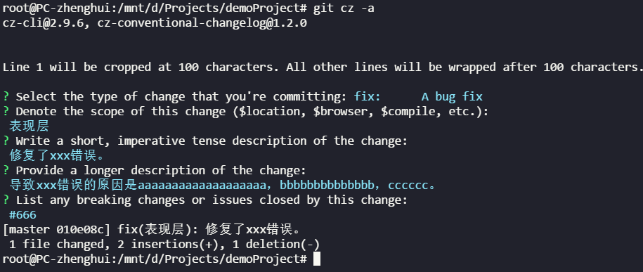

``` bash
> npm install -g commitizen
> npm install -g cz-conventional-changelog
> echo '{ "path": "cz-conventional-changelog" }' > ~/.czrc

```
安装成功后将`git commit <option>` 换为 `git cz <option>`。

**注意：**在Windows系统下，第三行命令会以UTF16的方式将内容写进文件中。这会导致调用commitizen时反序列话异常。可以通过VSCode对此文件以UTF-8进行Resave。然后在Windows下也能可以愉快的使用了。

