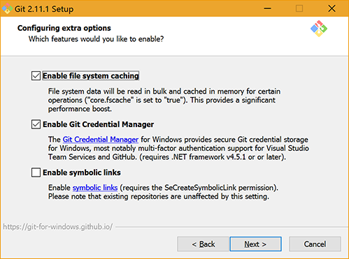

[git-scm](https://git-scm.com/downloads)提供了各个平台的Git的安装方式，在这里只介绍Windows下安装流程与配置。

## 获取 Git for Windows


下载地址：[Git for Windows](https://git-scm.com/download/win)

点击上面的链接后下载会自动开始。`由于数据是托管在AWS的S3储存中，翻墙可提高下载过程的稳定性。`

**注意：这是一个名为Git for Windows的项目，也叫做msysGit，它是Git基于[MSYS](http://www.mingw.org/wiki/MSYS)在Windows 上的一个实现，但不等同于Git本身。另一个是基于[CygWin](https://cygwin.com/git.html)来实现的。由此也能看出Git是比较依赖Linux系统的。**

## 安装

### 开源协议和条款，简单翻阅下一步即可。


### 安装路径


### 开始菜单文件夹


### 选择组件:

```
从上到下依次为：
 ┌─图标
 │  └─桌面快捷方式
 ├─Windows文件资源管理器集成
 │  ├─Git Bash
 │  └─Git GUI
 ├─关联.git配置文件至默认文件编辑器
 ├─关联.sh至Bash
 └─命令行窗口使用TrueType字体
```

* 文件资源管理器集成是指右键菜单的快捷方式，可以通过勾选来实现快速在指定目录打开Git命令行工具或Git自带的GUI工具。

* *.sh文件关联会影响使用MSYS和MinGW、Cygwin的开发人员。勾选时需要额外注意。


### 配置PATH环境变量

```
 ┌─只在Bash中使用Git命令
 ├─在cmd.bat命令提示符中使用Git命令
 └─在cmd.bat命令提示符中使用Git命令及Unix工具
```

此选项可能会波及使用MSYS和MinGW、Cygwin的开发人员，后两者可能会导致命令冲突，影响某些软件的使用。


### 行尾配置

* 第一个选项会在提交和迁出时自动更新文件的行尾。

* 第二个选项只在提交时对行尾进行替换。

* 第三个选项是保持文件默认的行尾信息。

此选项主要是为了兼容跨平台文件的行尾定义。Windows系统行尾使用的是`/r/n`,而类Unix操作系统的行尾是`/n`。**默认选择第一项即可，跨平台开发、交叉编译根据自己的实际情况进行选择。**


### 配置终端模拟器

* 选择MinTTY作为Git命令的终端界面。

* 选择Windows默认控制台作为Git命令的终端界面。

Windows自带默认界面存在字符集、更新窗口大小等问题。**默认选择第一项即可，使用Vim工具进行提交的用户请务必选择第一项。**


### 配置特性

* 是否启动文件缓存：建议勾选，文件缓存会提升性能。

* 是否启动Git权限管理：建议勾选，用于在权限不足时输入凭据，并保存。

* 是否启动快捷方式支持：关闭，在Git Bash中使用ln命令会创建目标文件的副本而非指向目标文件的链接，如果需要使用链接，请勾选此选项。




### 实验组件

* 是否启用公测中的内嵌diff工具。


### 安装成功


安装后的开始菜单中的快捷方式及对应的窗体如下：


* Git Bash使用的是MinTTY终端。

* Git CMD使用的是Windows命令提示符。

* Git GUI是Git自带的一个简单的图形用户交互界面。

## 安装后的配置

安装后，需要使用Git命令对用户信息进行初始化，初始化内容包括用户名及邮箱，此过程不需要凭据，仅作为区别用户的标识。设置命令如下

``` bash
git config --global user.username ZhengHui
git config --global user.email zhengh@northloong.com
```

在Git Bash的演示效果如下：


```
Git允许针对不同的仓库使用不同的用户名和密码。
设置时将当前目录切换到工程所在目录，使用如下命令对当前仓库进行初始化
git config user.username ShineSmile
git config user.email ShineSmile@outlook.com
```

至此，Git的安装过程告一段落。


