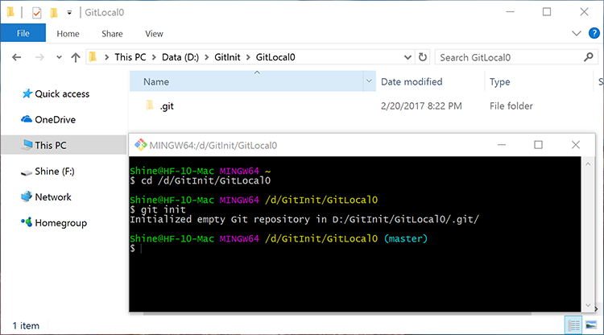
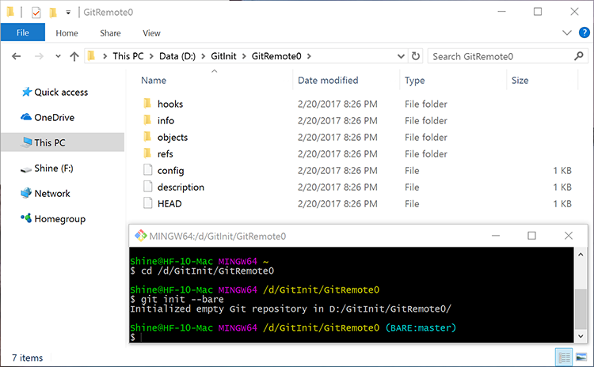

# Git init 2.1：Git仓库的初始化

## 初始化本地仓库

``` bash
git init
```

此命令将所在文件夹初始化为git本地仓库。初始化成功的标志为，文件夹内创建了一个名为`.git`的隐藏子文件夹。`git`子文件夹为**本地仓库**，`.git`所在文件夹是版本控制工作区。




本系列文章的标题即取自`git init`命令。

## 初始化远端仓库

``` bash
git init --bare
```

`--bare`参数表示将当前文件夹初始化为不包括工作区的裸库。其文件结构与本地仓库相似，但某些参数不同。远端仓库主要用于本地仓库之间的同步。远端仓库不能提交代码。只能由本地仓库推送或获取。



