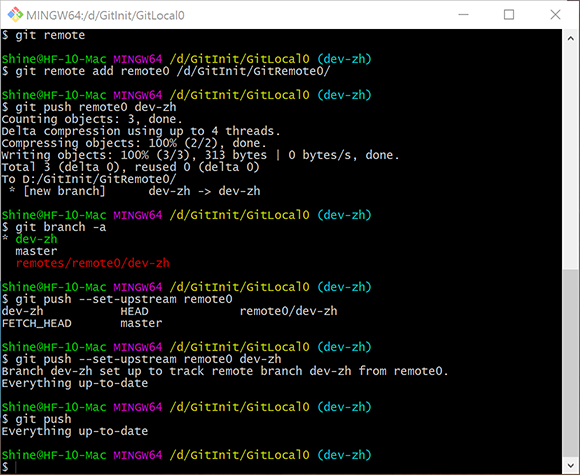
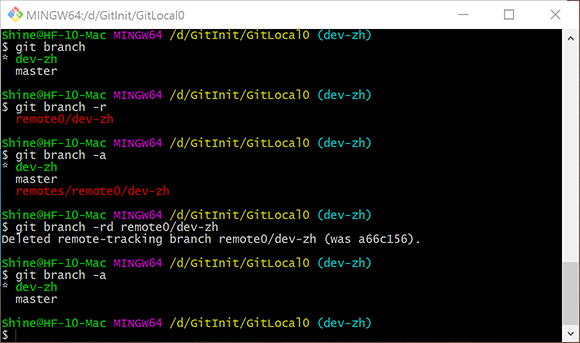

# Git init 2.4：分支与远端管理

## 本地分支管理：git branch

### 添加分支

``` bash
git branch <branch_name>
```

### 查看分支

``` bash
git branch
```

### 删除分支

``` bash
git branch -d <branch_name>
```

### 检出分支

``` bash
git checkout <branch_name>
```

`master`分支一般被作为主分支使用。也是git的默认分支。

需要注意的是如果工作区存在文件变更，在新建、切换、删除分支时会报错。**建议所有的分支操作都在完成提交之后进行。以免发生信息丢失。**


## 远端管理：git remote

### 添加远端仓库链接

``` bash
git remote add <remote_name> <remote_url>
```

`<remote_name>`表示远端名称，`<remote_url>`表示远端的地址。远端地址可以基于文件系统协议、HTTP协议、ssh协议等等。

一个远端仓库可以用于多个本地仓库的同步，一个本地仓库也可以使用多个远端仓库进行备份。

远端仓库需要使用`git init --bare`进行初始化，本地仓库的`.git`通过修改配置文件也可以作为远端仓库使用，存在修改他人仓库的风险，因此不推荐。

远端仓库的默认名称为`origin`，只有一个仓库时建议使用此名称。

### 查看远端仓库链接

``` bash
git remote 
```

### 删除远端仓库链接

``` bash
git remote remove <remote_name>
```


## 推送至远端：git push 

### 将分支推送到远端

``` bash
git push <remote_name> <branch_name>
```

### 将分支推送到远端并且对远端分支进行追踪

``` bash
git push --set-upstream <remote_name> <branch_name>
```

### 追踪了远端分支的本地分支可以不加分支名进行推送

``` bash
git push <remote_name>
```



## 远端分支管理

### 查看远端分支
``` bash
git branch -r
```

### 查看所有分支

``` bash
git remote -a
```

### 删除远端分支

``` bash
git remote -rd <remote_branch_name>
```

`-r`参数表示远端分支。



## 打标签：git tag

### 在提交记录中打标签

``` bash
git tag -a <tag-name> -m <tag-message> <commit-hash>
```

`<tag-name>`为标签名称，例如：*ver.1.0*。`<tag-message>`为标签信息，可以省略。`<commit-hash>`为提交版本号，如果省略则为当前所在分支打TAG。

### 推送本地标签至远端

``` bash
git push <remote_name> <tag_name>
```

### 迁出远端的标签

``` bash
git checkout -b <branch_name> <tag_name>
```

`git tag`可以用于版本的发布，问题版本的标记。

分支的实质与指针类似。分支指向某一次具体的提交记录，在此提交记录的基础上进行修改，进行新的提交后，分支将跟随指向新的提交记录。标签是不会跟随新的提交而移动的。


