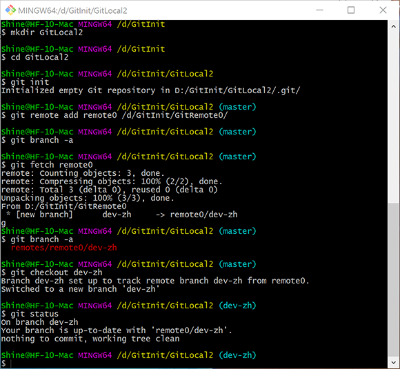

# 获取远端仓库至本地仓库：git fetch

``` bash
git fetch <remote_name>
```

此命令仅仅使本地仓库与远端仓库同步。不会改变工作区的内容。



# 克隆仓库：git clone

``` bash
git clone <remote_url>
```

`git clone`命令是一个复合命令，一次性完成了根据url创建文件夹、切换到此文件夹、初始化仓库、获取远端仓库至本地仓库，最后检出master分支一系列命令。

``` bash
mkdir <repo_name>
cd <repo_name>
git init
git remote add origin <remote_url>
git fetch origin
git checkout master
```


# 合并分支：git merge

``` bash
git merge <target_branch>
```

## fast-forward分支的合并

两个分支源自同一个起点，其中一个分支经过修改、提交、另一个分支未做任何操作。这是经过修改的分支就是`fast-forward`分支。合并`fast-forward`分支时会自动将当前分支跟进至`fast-forward`分支。

## `non-fast-forward`分支的合并

这种情况比较复杂，两个分支源自相同的起点，并分别做了不同的提交。两者合并过程会创建一个新的提交。如果合并过程中产生冲突，需要在提交前解决冲突。

多人协作开发过程中，如果在相同的分支协作开发，会频繁的进行的`non-fast-forward`分支。避免这种问题的方式是将将主分支保护起来，具体做法会在[git  init 4：协作开发的分支管理](git-init-4)进行说明。


# 拉取分支：git pull 

``` bash
git pull <remote_name> <remote_branch>
```

拉取和克隆一样也是一个复合命令，首先会获取目标分支，然后会将目标分支合并到当前分支。其相当于以下命令的组合。

``` bash
git fetch <remote_name>
git merge <remote_branch> 
```

这里需要注意一点：如果远端所在的分支不是当前分支的上游分支。合并的过程就是`non-fast-forward`分支的合并流程。上图`non-fast-forward`的合并过程给出了使用`git pull`命令的建议。在实际的开发过程中，建议慎用`pull`操作，将`fetch`与`merge`操作分开进行，显示进行合并操作

# 相关链接

Github还提供了一个用于学习Git命令的挑战，一共25道习题。全部做完大概需要15分钟，讲解的也比较全面，地址如下：[Git Tutorial - Try Git](https://try.github.io)。