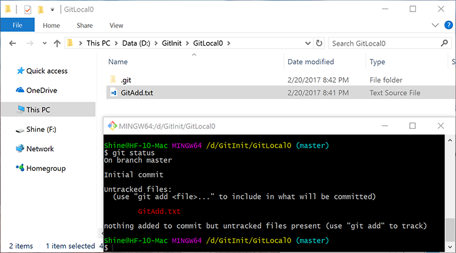
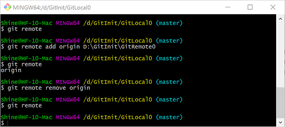

## Git仓库的初始化：git init

### 初始化本地仓库

``` bash
git init
```

此命令将所在文件夹初始化为git本地仓库。初始化成功的标志为，文件夹内创建了一个名为`.git`的隐藏子文件夹。`git`子文件夹为**本地仓库**，`.git`所在文件夹是版本控制工作区。

#### 本地仓库的初始化：


#### 本地仓库文件结构：


本系列文章的标题即取自`git init`命令。

### 初始化远端仓库

``` bash
git init --bare
```

`--bare`参数表示将当前文件夹初始化为不包括工作区的裸库。其文件结构与本地仓库相似，但某些参数不同。远端仓库主要用于本地仓库之间的同步。远端仓库不能提交代码。只能由本地仓库推送或获取。


## 查看变更的文件：git status

``` bash
git status
```

`git status`命令会列出当前所在的分支，发生变更的文件，以及相关提示。


## 添加文件至缓存区：git add

### 添加一个文件

``` bash
git add <filename>
```

`git add`命令会将指定的文件的**当前状态**添加到**暂存区**中。注意这里的**暂存区**与**本地仓库**不是同一个位置。如果与SVN类比，相当于提交过程中对文件的勾选。**只有暂存的文件会在后续的提交中被提交。**


1. 上述过程创建了内容为*git add test*的txt文本文档。

2. 使用`git status`表示其为`untracked`，即未被版本控制追踪。

3. 使用`git add`将其添加至缓存区后可以在`git status`中观察到其状态为`Changes to be committed`，即将被提交的变更。

4. 再次修改这个文件，可以看到文件即被缓存，又被修改。首先暂存区只会暂存执行`git add`命令时的文件状态，**后续的修改并不会被自动暂存，也不会被后续的提交操作提交。**

5. 若要将新的变更添加到缓存区，只需再次运行`git add`命令即可。

### 添加所有未被追踪的文件

``` bash
git add .
```


## 将文件移出暂存区：git rm --cached

``` bash
git rm --cached <filename>
```

`git rm`命令会移除**暂存区**中指定的文件。不会对文件进行修改。

如果文件在暂存后再次被编辑，需要添加`-f`强制执行参数。`git rm -f --cached`。同样，命令仅仅会将文件从暂存区移除，文件的编辑结果不会丢失。

## 提交 git commit

``` bash
git commit -m "提交信息"
```

`git commit`会将暂存区里的数据提交到**本地仓库**。省略`-m`参数会调用Vim工具编辑提交信息。


## 查看提交历史

``` bash
git log
```


## 本地分支管理：git branch

### 添加分支

``` bash
git branch <branch_name>
```

### 查看分支

``` bash
git branch
```

### 删除分支

``` bash
git branch -d <branch_name>
```

### 检出分支

``` bash
git checkout <branch_name>
```

`master`分支一般被作为主分支使用。也是git的默认分支。

需要注意的是如果工作区存在文件变更，在新建、切换、删除分支时会报错。**建议所有的分支操作都在完成提交之后进行。以免发生信息丢失。**


## 远端管理：git remote

### 添加远端仓库链接

``` bash
git remote add <remote_name> <remote_url>
```

`<remote_name>`表示远端名称，`<remote_url>`表示远端的地址。远端地址可以基于文件系统协议、HTTP协议、ssh协议等等。

一个远端仓库可以用于多个本地仓库的同步，一个本地仓库也可以使用多个远端仓库进行备份。

远端仓库需要使用`git init --bare`进行初始化，本地仓库的`.git`通过修改配置文件也可以作为远端仓库使用，存在修改他人仓库的风险，因此不推荐。

远端仓库的默认名称为`origin`，只有一个仓库时建议使用此名称。

### 查看远端仓库链接

``` bash
git remote 
```

### 删除远端仓库链接

``` bash
git remote remove <remote_name>
```



## 推送至远端：git push 

### 将分支推送到远端

``` bash
git push <remote_name> <branch_name>
```

### 将分支推送到远端并且对远端分支进行追踪

``` bash
git push --set-upstream <remote_name> <branch_name>
```

### 追踪了远端分支的本地分支可以不加分支名进行推送

``` bash
git push <remote_name>
```


## 远端分支管理

### 查看远端分支
``` bash
git branch -r
```

### 查看所有分支

``` bash
git remote -a
```

### 删除远端分支

``` bash
git remote -rd <remote_branch_name>
```

`-r`参数表示远端分支。


## 获取远端仓库至本地仓库：git fetch

``` bash
git fetch <remote_name>
```

此命令仅仅使本地仓库与远端仓库同步。不会改变工作区的内容。


## 克隆仓库：git clone

``` bash
git clone <remote_url>
```

`git clone`命令是一个复合命令，一次性完成了根据url创建文件夹、切换到此文件夹、初始化仓库、获取远端仓库至本地仓库，最后检出master分支一系列命令。

``` bash
mkdir <repo_name>
cd <repo_name>
git init
git remote add origin <remote_url>
git fetch origin
git checkout master
```


## 合并分支：git merge

``` bash
git merge <target_branch>
```

### fast-forward分支的合并

两个分支源自同一个起点，其中一个分支经过修改、提交、另一个分支未做任何操作。这是经过修改的分支就是`fast-forward`分支。合并`fast-forward`分支时会自动将当前分支跟进至`fast-forward`分支。

### `non-fast-forward`分支的合并

这种情况比较复杂，两个分支源自相同的起点，并分别做了不同的提交。两者合并过程会创建一个新的提交。如果合并过程中产生冲突，需要在提交前解决冲突。

多人协作开发过程中，如果在相同的分支协作开发，会频繁的进行的`non-fast-forward`分支。避免这种问题的方式是将将主分支保护起来，具体做法会在[git  init 4：协作开发的分支管理](git-init-4)进行说明。


## 拉取分支：git pull 

``` bash
git pull <remote_name> <remote_branch>
```

拉取和克隆一样也是一个复合命令，首先会获取目标分支，然后会将目标分支合并到当前分支。其相当于以下命令的组合。

``` bash
git fetch <remote_name>
git merge <remote_branch> 
```

这里需要注意一点：如果远端所在的分支不是当前分支的上游分支。合并的过程就是`non-fast-forward`分支的合并流程。上图`non-fast-forward`的合并过程给出了使用`git pull`命令的建议。在实际的开发过程中，建议慎用`pull`操作，将`fetch`与`merge`操作分开进行，显示进行合并操作

## 忽略文件 .gitignore

操作系统的运行过程、开发环境的部分配置文件、编译器的编译过程，编译结束后生成的文件通常不需要提交到版本库中进行追踪，一方面此类文件可以通过源代码生成，另一方面反复提交编辑结果会导致版本控制仓库体积的剧增，不利于版本控制工具的维护。

Git使用`.gitignore`这个配置文件对不需要提交的文件进行忽略，达到节省开销的目的。

`.gitignore`文件在编辑时遵循以下原则：

* 以斜杠“/”开头表示目录；

* 以星号“*”通配多个字符；

* 以问号“?”通配单个字符

* 以方括号“[]”包含单个字符的匹配列表；

* 以叹号“!”表示不忽略(跟踪)匹配到的文件或目录；

需要注意以下几点：

* 匹配顺序为自上而下。

* `.gitignore`是工作目录的一部分，建议提交时对其进行更新。

* 已经被版本控制追踪的文件无法通过修改`.gitignore`文件进行忽略，如果需要在后续版本中忽略，请删除这个文件并把删除行为添加到缓存区进行提交。

* `.gitignore`的使用与选择不仅与开发语言有关，还会受到开发环境、编译器、平台等因素的影响。

Github的[github/gitignore](https://github.com/github/gitignore)项目中提供了一些语言及开发环境使用的`.gitignore`模板。

下面列出了C++语言使用的`.gitignore`模板：

```
# Prerequisites
*.d

# Compiled Object files
*.slo
*.lo
*.o
*.obj

# Precompiled Headers
*.gch
*.pch

# Compiled Dynamic libraries
*.so
*.dylib
*.dll

# Fortran module files
*.mod
*.smod

# Compiled Static libraries
*.lai
*.la
*.a
*.lib

# Executables
*.exe
*.out
*.app
```
Python的`.gitignore`文件：

```
# Byte-compiled / optimized / DLL files
__pycache__/
*.py[cod]
*$py.class

# C extensions
*.so

# Distribution / packaging
.Python
env/
build/
develop-eggs/
dist/
downloads/
eggs/
.eggs/
lib/
lib64/
parts/
sdist/
var/
wheels/
*.egg-info/
.installed.cfg
*.egg

# PyInstaller
#  Usually these files are written by a python script from a template
#  before PyInstaller builds the exe, so as to inject date/other infos into it.
*.manifest
*.spec

# Installer logs
pip-log.txt
pip-delete-this-directory.txt

# Unit test / coverage reports
htmlcov/
.tox/
.coverage
.coverage.*
.cache
nosetests.xml
coverage.xml
*,cover
.hypothesis/

# Translations
*.mo
*.pot

# Django stuff:
*.log
local_settings.py

# Flask stuff:
instance/
.webassets-cache

# Scrapy stuff:
.scrapy

# Sphinx documentation
docs/_build/

# PyBuilder
target/

# Jupyter Notebook
.ipynb_checkpoints

# pyenv
.python-version

# celery beat schedule file
celerybeat-schedule

# SageMath parsed files
*.sage.py

# dotenv
.env

# virtualenv
.venv
venv/
ENV/

# Spyder project settings
.spyderproject

# Rope project settings
.ropeproject
```

## 相关链接

Github还提供了一个用于学习Git命令的挑战，一共25道习题。全部做完大概需要15分钟，讲解的也比较全面，地址如下：[Git Tutorial - Try Git](https://try.github.io)。