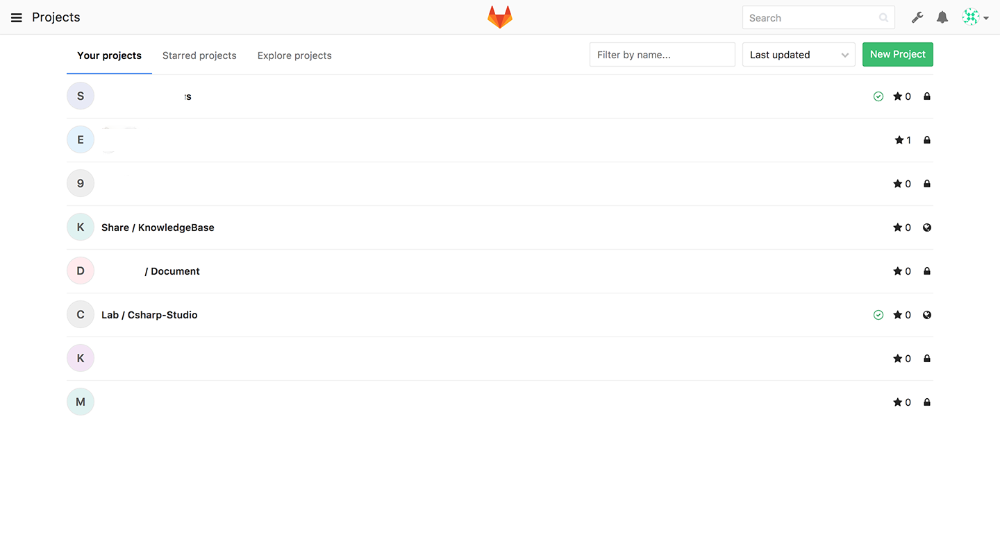
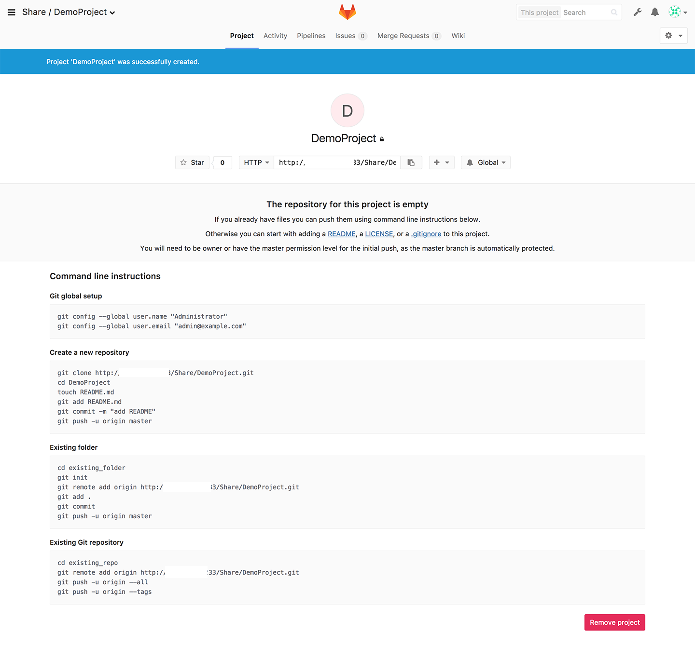

[GitLab](https://about.gitlab.com/)是一款基于Git的版本控制及工程管理工具。其提供收费的企业版及免费的社区版。除了Git远端的管理、用户授权管理外，还提供了实现持续集成、持续发布的[Runner](https://docs.gitlab.com/runner/)等等。其UI元素、Issue管理是仿照GitHub进行设计的。界面简洁容易上手。可以从[这里](https://about.gitlab.com/downloads/)了解GitLab的安装流程。

本文主要简要介绍GitLab对用户组、用户、工程的创建及管理。

## Gitlab管理界面

### 用户主界面

主界面可以在用户权限下的Git仓库列表。

管理员用户可以在右上角找到扳手的图标，点击就可以进去管理界面。

### 管理界面

这个界面包含各种状态、组件版本、以及工程、用户、用户组及相关信息。（原谅我做了遮挡处理。）

### 添加用户

指定用户的用户名及邮箱，添加用户时是不能对用户密码进行设置的。如果启用了邮件功能，填写的邮箱地址可以收到初始化密码的邮件。如果未开启邮件功能，可以添加用户后回到用户编辑界面进行初始化。初始化的密码需要用户在下一次登录时进行修改。

### 添加用户组

### 添加新工程

添加时可以选择所属用户组（或用户）及工程名称，修改工程的方位级别。

创建完成后，会自动跳转到工程页面，能够看到仓库的初始化引导。拿到图示中的URL后就可以添加到本地仓库中的远端进行推送了。在顶端还可以看到活动、生产管线、问题、合并请求、Wiki目录。

重新通过管理界面进入工程则可以看到工程的相关信息，还能调整工程对应的用户组及用户的权限。

GitLab的权限分为以下几种：
* Guest：最基本的访问权限
* Reporter：提交Issue的权限
* Developer：提交代码、创建分支的权限
* Master：控制master分支的权限
* Owner：拥有所有权限

------

以上内容基本能够满足代码管理及权限控制的功能。持续集成管线等扩展功能不在这里赘述。有时间的话会另写一篇总结下Runner的使用。

