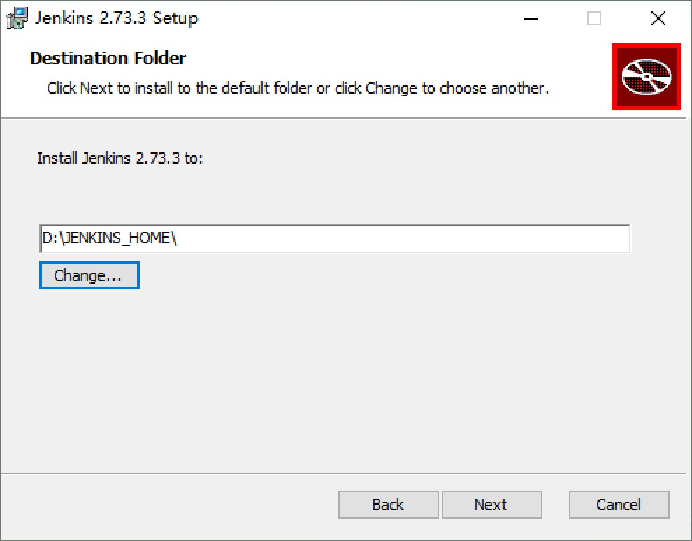
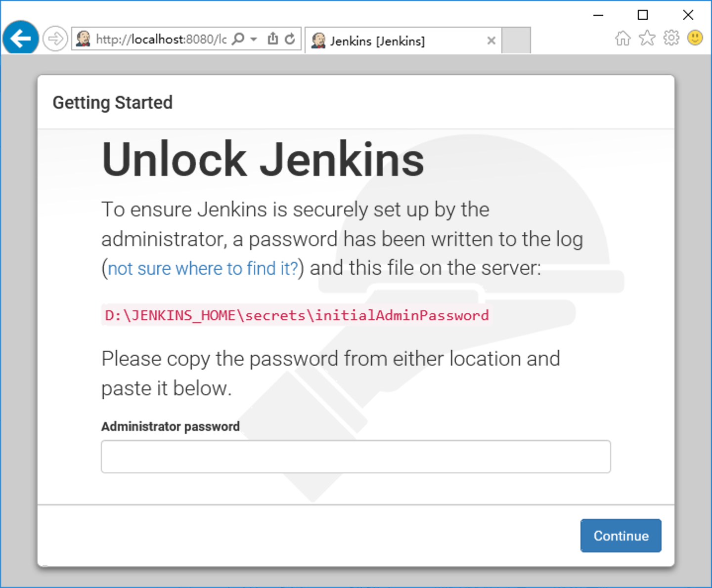
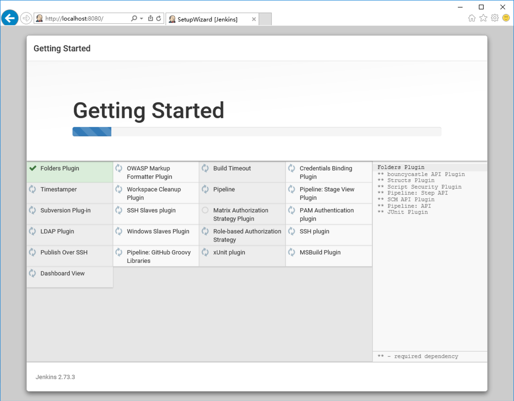
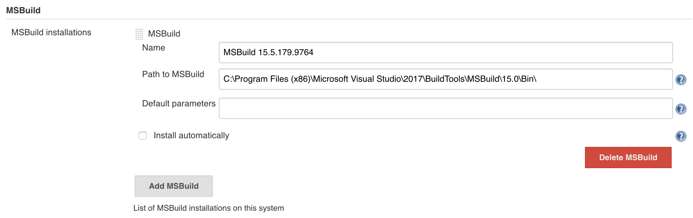
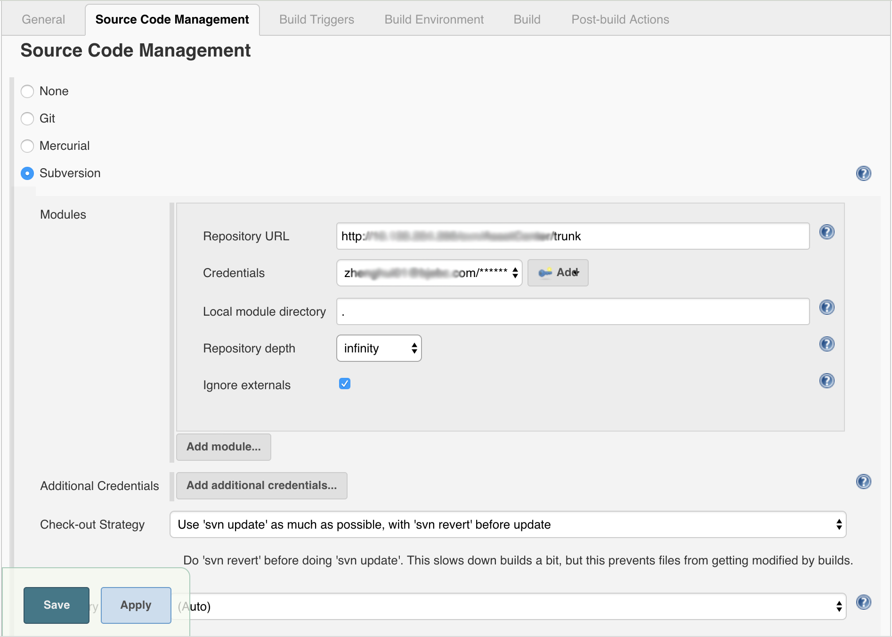
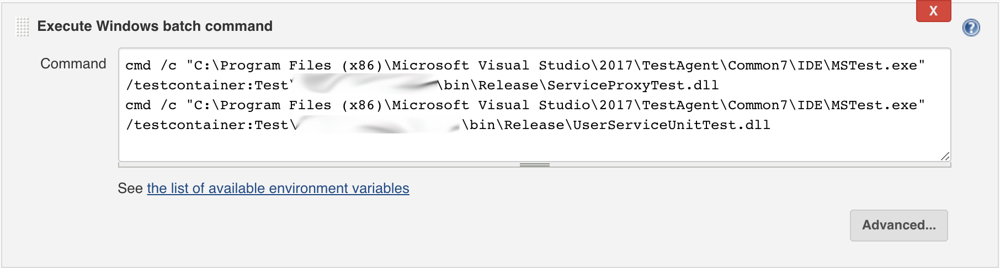
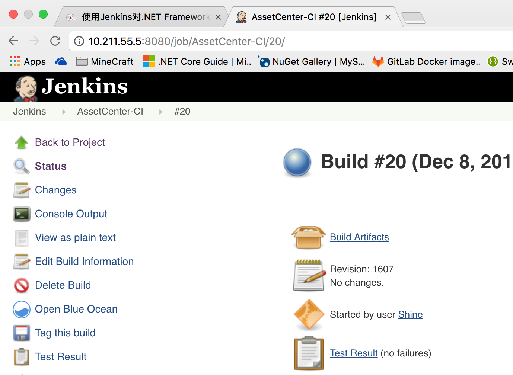

本文使用Windows平台上的Jenkins完成.NET Framework平台的CICD相关工作。
**注意:本文通过多次修改调整，示例图片中的路径、配置可能过期，仅供参考，待图片更新后将删除此提示。**

# 安装及配置Jenkins

[Windows平台Jenkins下载地址](https://jenkins.io/download/thank-you-downloading-windows-installer-stable)
解压后双击安装MSI软件包即可开始安装。安装过程中的设置路径为**%JENKINS_HOME%**的位置，也是服务的安装位置，此路径在不重装的前提下很难修改，建议谨慎选择。Jenkins服务可以通过服务Windows管理工具进行停止及重启。

# 首次登陆

服务的默认端口为8080，首次登陆时jenkins会要求在服务端指定路径找到秘钥文件对所有权进行验证。

通过验证后可以选择是否调整默认插件集并进行安装。

# Jenkins插件

新插件可以在`系统管理-插件管理-可用插件`进行安装。
部分插件的配置在`系统管理-全局工具配置（Global Tool Configuration）`下。

## 补充安装

* **MSBuild Plugin**：在可视化界面配置和管理MSBuild构建工具版本的插件。
* **MSTest Plugin**：可以在单元测试执行后将测试报告归档。建议安装。
* **MSTestRunner Plugin**：在可视化界面配置和管理MSTest构建工具版本的插件。
    **注意:当前版本MSTestRunner存在路径权限问题，已改用Windows批处理替代。**
* **Blue Ocean**:可以根据构建阶段将构建日志拆分成不同的阶段。可酌情安装。

## MSbuild插件配置

## MSTestRunner插件配置

# 持续集成

Jenkins通过**工作 Jobs**来管理任务。
点击`create new jobs`

初次使用选择自由风格的工程

## 源代码迁出

如图配置需要迁出的工程，

* Repository Url：仓库地址。
* Credentials：需要拥有此仓库迁出权限的用户名密码。可以通过后面的Add按钮添加。
* Local module directory：建议使用默认值。
* Repository Depth：`infinity`表示完整迁出，`empty`表示不迁出任何内容。files只迁出当前目录的文件，这种迁出方式会在后续迁出jenkinsfile时用到。
* Check-out Strategy：迁出策略，这里选择迁出前回滚代码，防止上次的编译过程对工程造成影响。

## 修复

*Tip:使用`cmd /c "path/to/command"`执行可能出现歧义的命令。*

## 构建

## 测试

由于MSTest插件存在权限bug，使用批处理代替：

## 归档

归档测试

归档测试结果

测试及构建结果可以通过在构建详情中查看下载。

# 更改工作空间及构建历史的位置

可以根据工程需要在Jenkins的系统设置中变更工作空间及构建历史的位置。
位置变更后，变更前的构建历史在Jenkins中可能不可用，可以通过文件系统在原来的位置进行查找。执行新的任务时，工程需要在新的工作空间重新迁出。
