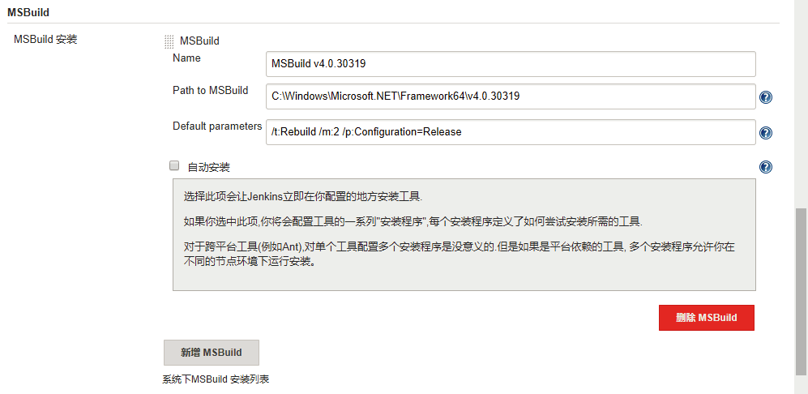

本文档直接使用Windows平台上的Jenkins完成.NET Framework平台的持续集成相关工作。安装过程请参阅Jenkins官方文档。[下载地址](https://jenkins.io/download/)

## 准备工作

### Windows相关准备
* 安装Visual Studio指定版本及相关扩展及插件。
* 将Visual Studio目录下或指定.NET工具集版本加入到环境变量*PATH*中，用于在安装过程中调试持续集成的编译脚本。
* 下载*nuget.exe*至任意目录，备用。`不明白为什么Visual Studio竟然连nuget这种工具集也进行集成。`(https://developer.microsoft.com/en-us/windows/downloads/windows-8-sdk)。
* 配置Jenkins工作目录

安装的默认路径为`C:\Program Files\Jenkins`文件夹下，工作目录默认在此文件夹的子目录中。此路径可能存在文件夹权限相关问题，建议修改。

具体操作如下：

1. 在服务管理中停止Jenkins服务。
1. 使用管理员权限编辑Jenkins根目录中的*config.xml*文件，修改*  <workspaceDir>D:\JENKINS</workspaceDir>*项为指定路径。
1. 启动jenkins服务。

### Jenkins相关准备

* 在Jenkins配置页面选择`Configure Credentials`添加版本控制工具使用的验证信息。
* 在Jenkins配置页面选择`插件管理-可选插件`搜索`MSBuild Plugin`进行安装并重启。
* 【可选】`Blue Ocean Plugin`提供了一些比较美观的视图，根据需要选择安装。
* 配置MSBUILD：在Jenkins的配置页面，选择`Global Tool Configuration`。如下图所示配置MSBUILD工具

图中指定了`.NET 4.0`版本，可以根据实际需求修正路径至指定版本。也可点击`新增MSBuild`按钮同时添加多个版本备用。

## 

